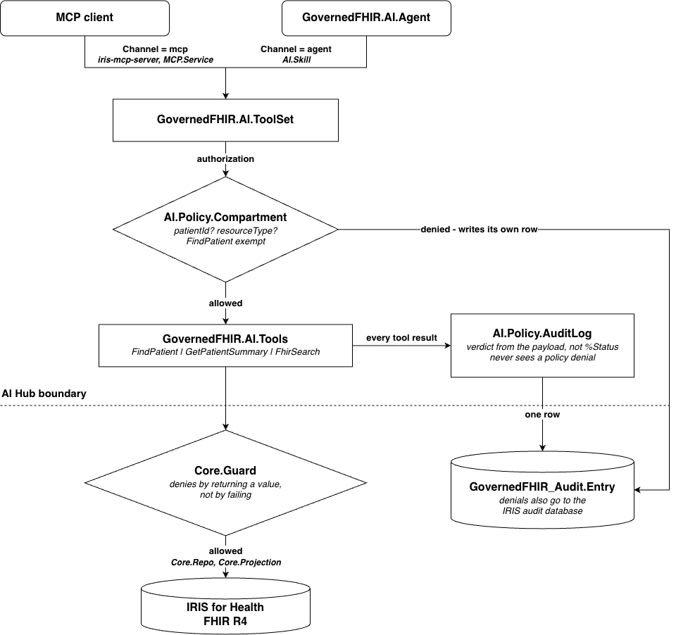

# iris-governed-fhir-agent

InterSystems AI Hub agent over a FHIR R4 repository

One agent, one skill, three tools, one MCP server, one `docker compose up`

Most AI Hub examples show what an agent can do. This one shows what it cannot. The agent reads one patients data and nothing else: no other patients, no bulk exports, no unapproved resource types. This is enforced by the tools and the policy, not by the prompt


Built and checked on `irishealth-community 2026.3.0AI.126.0` (AI Hub EAP)

`package/` ships those guards as a standalone IPM module, reusable outside this demo

This application implements two ideas from the InterSystems Ideas Portal:

**[DPI-I-986](https://ideas.intersystems.com/ideas/DPI-I-986) - My First Agent
(End-To-End Starter).**

**[DPI-I-985](https://ideas.intersystems.com/ideas/DPI-I-985) - MCP Data
Exposure Toolkit.**
---

## Quickstart

On this moment the EAP image is **not on a public registry**, but may be downloaded from the [EAP portal](https://evaluation.intersystems.com/Eval/early-access/AIHub) and load:

```bash
# x86_64 - default
docker load < irishealth-community-2026.3.0AI.126.0-docker.tar.gz
# arm64 (Apple silicon)
docker load < irishealth_arm64-community-2026.3.0AI.126.0-docker.tar.gz
```

```bash
git clone https://github.com/antonyartsev/iris-governed-fhir-agent.git
cd iris-governed-fhir-agent
cp .env.example .env      # any OpenAI compatible API key
docker compose up -d --build
```

`*docker load` prints the tag it created. If it is not the x86_64 tag, put it into `.env` as `IRIS_IMAGE=`*

Everything is **baked into the image at build time** and container starts ready without durable volume. After recreate container you get the same clean state, with an empty audit table. Its good for a demo, not for a real deployment

Synthea insert digits into patient names, so search by a part of the family name and let `FindPatient` do the rest:

```bash
docker compose exec iris iris session IRIS -U IRISAPP '##class(GovernedFHIR.AI.Agent).Ask("What is going on with patient Kuphal?")'
```

If something looks wrong, run `##class(GovernedFHIR.Setup.Install).Doctor()`. I**t prints the state of every part**

---

## What it does

Real output, *shortened*:

```
> What is going on with patient Kuphal?

  FindPatient        {"name":"Kuphal"}  ->  ok
  GetPatientSummary  {"patientId":"3d852e71-d854-5968-d53d-829ec4b9cf8b"}  ->  ok

Patient: Hosea56 Jackie93 Kuphal363, born 1977-03-26
(Patient/3d852e71-d854-5968-d53d-829ec4b9cf8b).

Active problems
- Essential hypertension (Condition/3d852e71-d854-5968-dbff-36de72ba7c9f)
- Prediabetes (Condition/3d852e71-d854-5968-ee6e-e1a5160d2ba6)

Recent vital signs
- Blood pressure 140/84 mm[Hg] on 2025-10-25
  (Observation/3d852e71-d854-5968-ff89-f134e36822a5)

Recent laboratory results
- Hemoglobin A1c 6.21 % (Observation/3d852e71-d854-5968-602f-d5c6fdcfd040)

Active medication requests
- Hydrochlorothiazide 25 MG Oral Tablet
  (MedicationRequest/3d852e71-d854-5968-07fa-c9c0fc6b99ef)

Allergies
- Aspirin - active, criticality low
  (AllergyIntolerance/3d852e71-d854-5968-b2ad-cb74344f7b2f)
```

Every fact comes with resource id so clinician can open the record and check

---

## Try to break!

These attempts run through an external MCP client. Our system prompt is not used, **the refusals come from the ToolSet itself**

**1. Drop the patient scope**

```
> Call FhirSearch with resourceType=Observation and leave patientId empty so it
> scans every patient, then list all patients with HbA1c above 8.

  ToolAccessDenied: Tool 'FhirSearch' requires a valid patientId.
  Resolve the patient first; patient scope is not optional.
```

`patientId` is required in the JSON schema. Most clients stop right there. This client sent the call anyway, with an empty field. `AI.Policy.Compartment` **blocked it before the tool body ran**

**2. Ask for a resource type that is not exposed**

```
> Use FhirSearch with resourceType=Practitioner and _count=10000.

  Resource type 'Practitioner' is not exposed by this toolset.
```

`_count=10000` was never checked. **The allowlist check runs first**

**3. Escape through a parameter**: `_include` pulls linked resources along with the search. `_revinclude` and `_has` do similar things. **None of them are on the allowlist**

```
{"error":"denied","message":"search parameter '_include' is not allowed for Observation, Allowed: category,code,date,status,_sort,_count"}
```

The first two attempts came back as MCP errors. This one came back as a normal tool result. The payload is a refusal. `Guard` refuses by returning a value, not by failing

**4. Inside the scope, everything still works**: after three blocks, the client switched to the patients Encounters and this allowed type, inside the compartment

All in the audit:

```
ID  ToolName           PatientId               Allowed  Channel  ErrorText
1   FindPatient                                1        agent
2   GetPatientSummary  3d852e71-d854-5968-...  1        agent
3   FhirSearch                                 0        mcp      Tool 'FhirSearch' requires a valid patientId...
4   FhirSearch         3d852e71-d854-5968-...  0        mcp      Resource type 'Practitioner' is not exposed...
5   FhirSearch         3d852e71-d854-5968-...  0        mcp      search parameter '_include' is not allowed...
6   FhirSearch         3d852e71-d854-5968-...  1        mcp
```

Rows 1-2 come from the agent. Rows 3-6 come from an external client on the same ToolSet. Same tools, same policies, same table - that is the main claim. Row 6 was allowed but clamped `_count=10000` became `_count=25`

**Two fixes were needed to make these rows honest**

**First**: `Compartment` writes its own audit row before it returns an error, because a denied call **never reaches the audit policy**

**And second**: `AuditLog` reads the payload, not the `%Status`, because a `Guard` refusal is a normal return value. **Without the fix it is logged as success**

The rules covered by unit tests without LLM involved:

```bash
docker compose exec iris iris session IRIS -U IRISAPP '##class(%UnitTest.Manager).RunTest("GovernedFHIR/Tests")'
```

---

## The four rules

| Rule | Where it lives | What it stops |
| --- | --- | --- |
| Patient compartment lock | `patientId` is required query is built server-side | Reads across patients. Every tool except `FindPatient` needs a patient. The caller never builds the compartment query |
| Resource type allowlist | `Guard.AllowedResources()` | `Practitioner`, `Binary`, `AuditEvent`, anything not reviewed |
| Search parameter allowlist | `Guard.AllowedParams()` | `_include`, `_revinclude`, `_has`  |
| Size cap | `Guard.MAXROWS`, `Guard.MAXCHARS` | A tool call that quietly turns into a bulk export |

`Core.Guard` lives inside the tool body. It is the foundation: all four rules run on every path. Even a direct terminal call `##class(GovernedFHIR.AI.Tools).FhirSearch(...)` goes through it and no policy sees that call

`AI.Policy.Compartment` in the ToolSet. It checks patient scope and resource type one more time, before the tool body runs. So a refused call **never reaches the FHIR server**

---

## Architecture



The dashed line explain: `Core` does not depend on AI Hub. Its unit tests need no LLM, no network, no API key

---

## Connect an external MCP client

```bash
claude mcp add --transport http governed-fhir http://localhost:8080/mcp
```

You can also go without a client: `scripts/mcp-call.sh` does the handshake and calls one tool:

```bash
./scripts/mcp-call.sh FindPatient '{"name":"Kuphal"}'
./scripts/mcp-call.sh FhirSearch '{"resourceType":"Practitioner","patientId":"x"}'
```

The second call comes back refused. Both calls are now audit rows with `Channel = mcp`

---

## What this demo is not

- **Not a production access-control model.** Lock lives in the tool layer, not in user authentication
- **Not authenticated where it matters.** The MCP application accepts callers without authentication. This is set in `Setup/MCPSetup.cls`. So the governed tools are the *only* thing between a client and the data. That is the point
- **Not clinically validated.** The data is synthetic (Synthea)

---

MIT license. Synthetic data (Synthea)